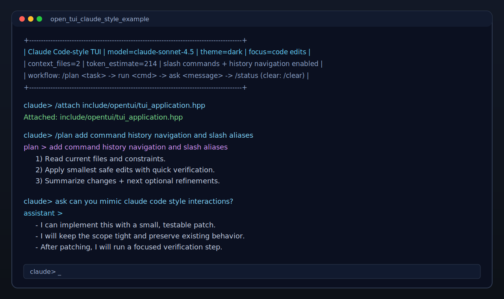

# open tui c++

`open tui c++` is a lightweight C++20 terminal UI library for building interactive CLI tools and debugger-like workflows.

## Highlights

- Overridable banner and prompt through inheritance.
- Built-in commands: `help`, `/help`, `clear`, `/clear`, `exit`, `/exit`, `quit`, `/quit`.
- Simple command registration API with argument handlers.
- Interactive tab completion for commands and custom sub-arguments (including common-prefix expansion).
- Inline autosuggestions (dim ghost text from completion/history), accepted with Right Arrow.
- Interactive command history navigation (`↑`/`↓`) in TTY mode.
- Fine-grained colored output (ANSI, with Windows virtual terminal support).
- Signal-aware run loop for clean termination (`SIGINT`, `SIGTERM`, `SIGHUP` on POSIX).
- UDP send/receive utility for external agent communication.
- C++20, CMake, `.clang-format`, and `.clang-tidy` included.
- Cross-platform target: macOS, Linux (Ubuntu), and Windows.

## Claude Code-style Demo

A new demo app was added to showcase a Claude Code-like terminal flow:

- shell chrome/status strip (`/status`)
- slash commands (`/model`, `/theme`, `/attach`, `/files`, `/focus`, `/plan`)
- argument autocomplete (model/theme/focus/plan/run starters + filesystem path completion for `/attach`)
- assistant-style message command (`ask`)
- tool run simulation command (`run`)
- built-in clear behavior (`/clear`)

### Snapshot

Example snapshot included in this repository:



## Build

```bash
cmake -S . -B build
cmake --build build
```

## Run examples

```bash
# Existing debugger sample
./build/open_tui_example

# Claude Code-style sample
./build/open_tui_claude_style_example
```

Or via task helper:

```bash
./scripts/tasks.sh run-example
./scripts/tasks.sh run-claude-example
```

## Lint and format

```bash
find include src examples -type f \( -name '*.hpp' -o -name '*.cpp' \) -print0 | \
  xargs -0 clang-format --dry-run --Werror
```

macOS (Homebrew LLVM) clang-tidy example:

```bash
SDKROOT=$(xcrun --show-sdk-path)
clang-tidy -p build src/*.cpp examples/debugger/main.cpp examples/claude_code/main.cpp \
  --extra-arg=-isysroot --extra-arg=$SDKROOT --quiet
```

## Library usage

1. Inherit from `opentui::TuiApplication`.
2. Override `banner()` and optionally `prompt()`, `on_start()`, `on_shutdown()`.
3. Implement `register_commands(opentui::CommandRegistry&)` and add commands.
4. Call `run()` from `main()`.

Minimal example:

```cpp
class MyApp : public opentui::TuiApplication {
protected:
  std::string banner() const override { return "my app"; }

  void register_commands(opentui::CommandRegistry& registry) override {
    registry.add(opentui::Command{
      .name = "ping",
      .description = "prints pong",
      .handler = [](const opentui::Args&, opentui::CommandContext& ctx) {
        ctx.console.println("pong");
      },
      .completer = nullptr,
    });
  }
};
```
